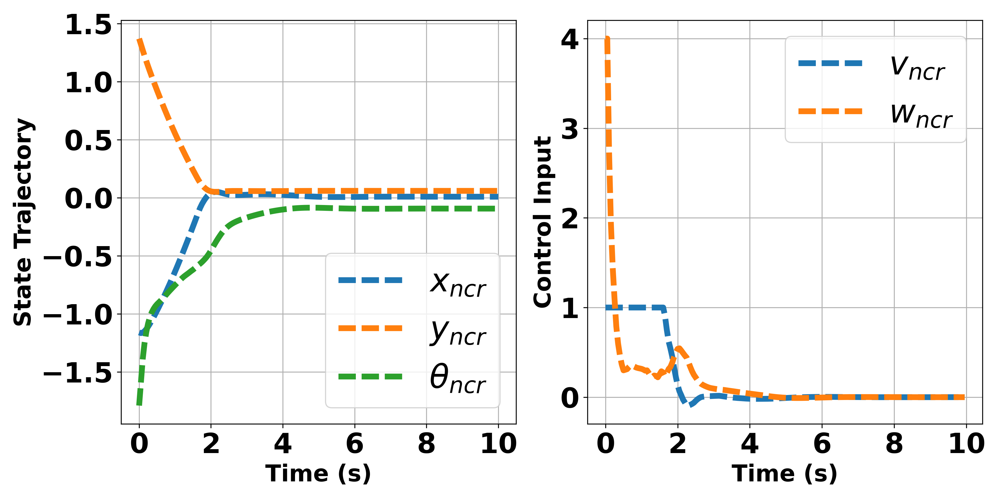
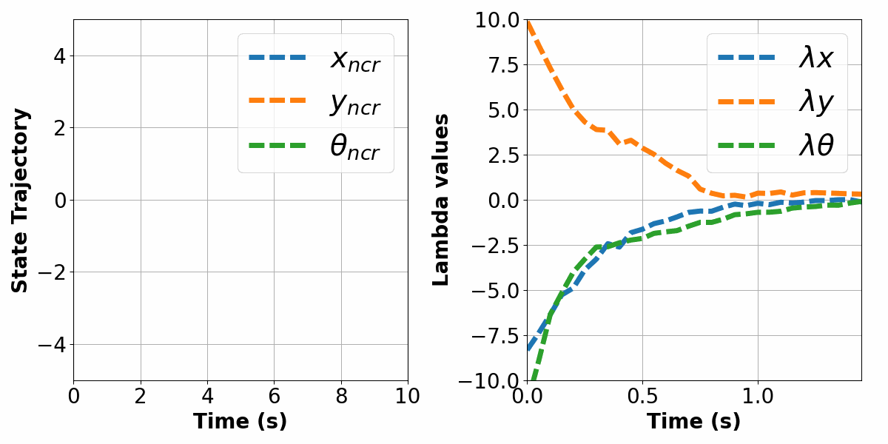
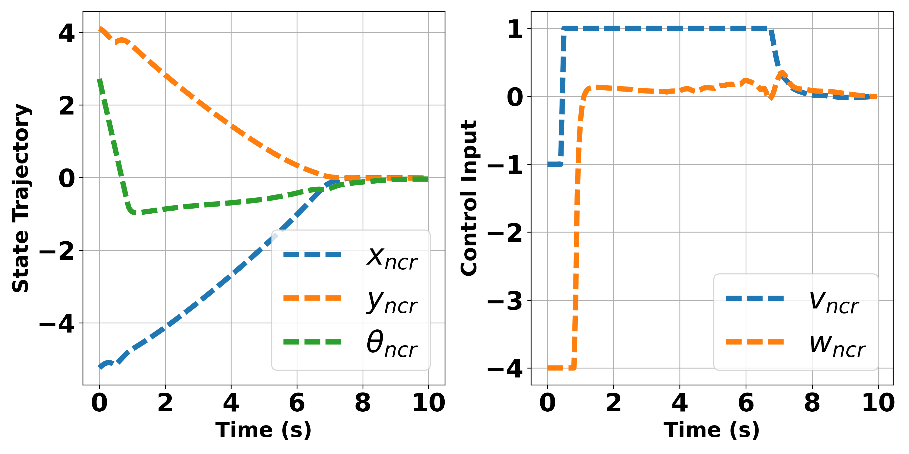
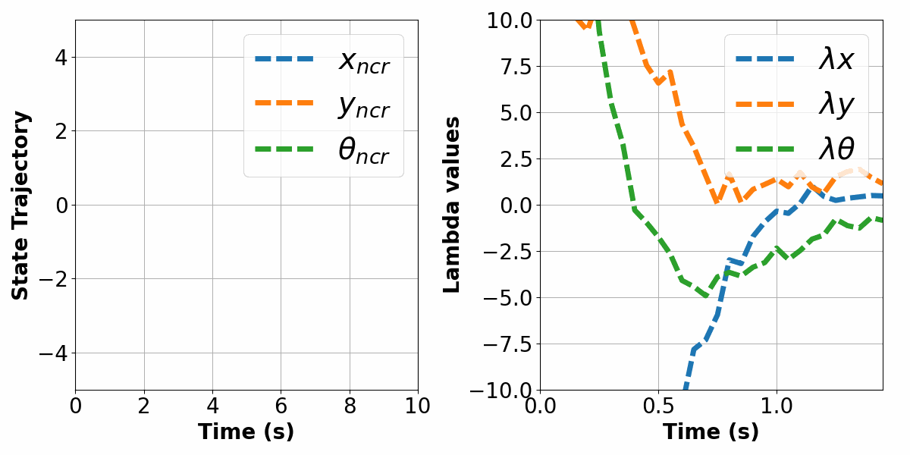
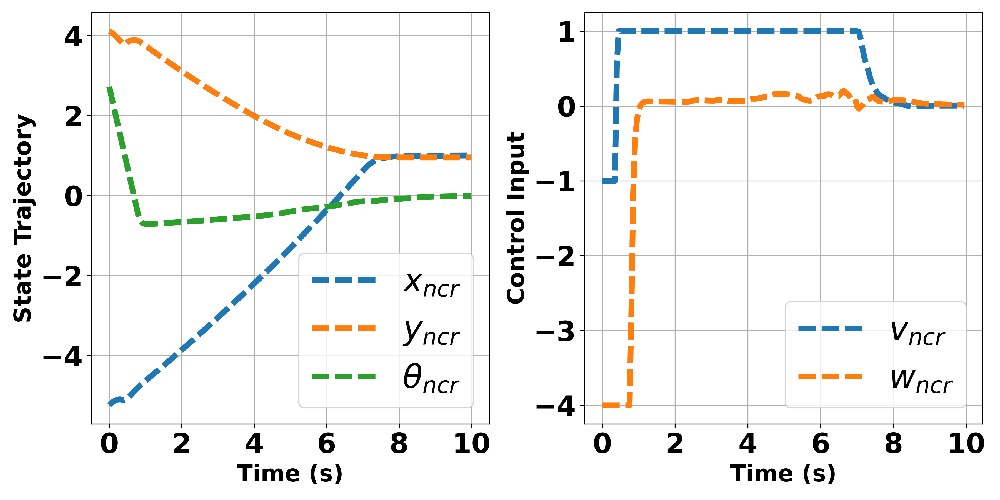
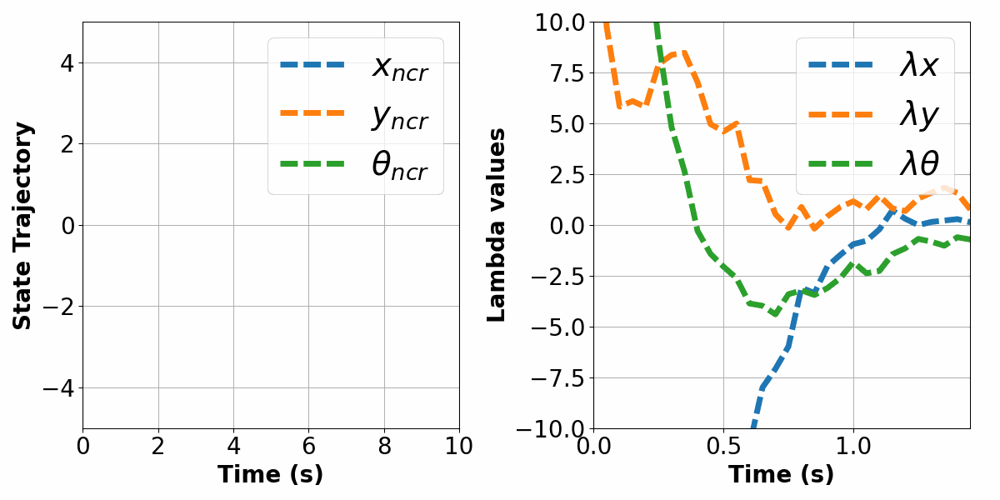

# Overview

This repository constains the code for the paper "Neural Co-state Regulator: A Data-Driven Paradigm for Real-time Optimal Control with Input Constraints" published at *Conference on Decision and Control (CDC), 2025*. More detailed information can be found at this [website](https://lihanlian.github.io/neural_co-state_regulator/). 

## Results

**Case A: Seen initial conditions and zero reference**
<p align="center">
  
  
</p>

**Case B: Unseen initial conditions and zero reference**
<p align="center">
  
  
</p>

**Case C: Unseen initial conditions and nonzero reference**
<p align="center">
  
  
</p>

## Run Locally

Clone the project and go to project directory
```bash
  python3 -m venv env && source env/bin/activate 
```
```bash
  pip install -r requirements.txt
```
 - _config.py_ is the file that stores the value of used parameters such as sampling time (dt), preidction horizon (N), range of input constraints, etc.
 - _MPC.py_ defines the Model Predictive Control (MPC) class.
 - run _train.py_ and to train the Co-state Neural Network (CoNN) used in Neural Co-state Regulator (NCR).
 - run _sim_mpc.py_, _sim_ncr.py_ to make the simulation result using MPC and NCR approach respectively.
 - run _comparison\_plot.py_ to visualize both NCR and MPC computational speed vs prediction horizon. 

## License

[MIT](./LICENSE)

